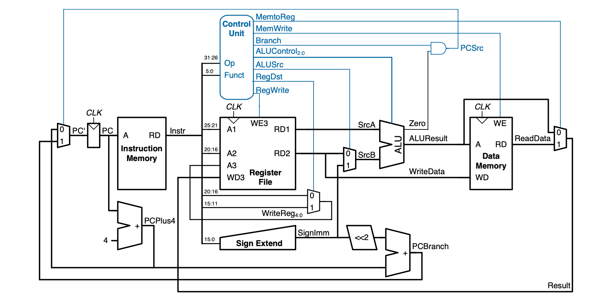
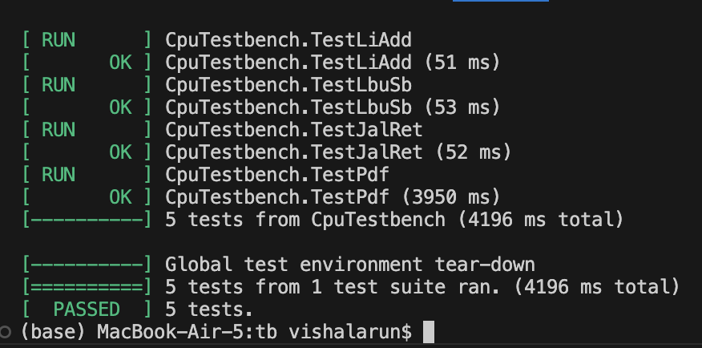
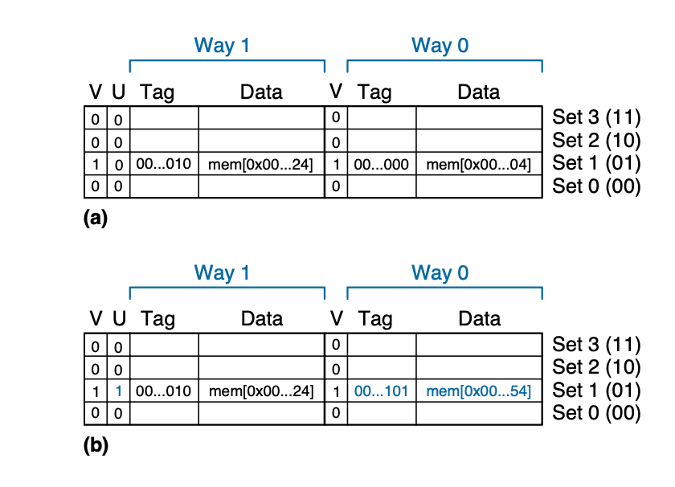
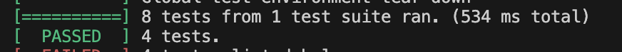

# RISC-V-Team17

RISC-V 32I CPU designed as part of the Instruction Architectures and Compilers class.

---
## Personal Statements

- [Vishal](statements/Vishal.md)
- [Raph](statements/Raph.md)
- [Nikhil](statements/Nikhil.word)
- [Emir]()

---
## Table of Contents

- [Quick Start](#quick-start)
- [Single Cycle](#single-cycle)
- [Pipelined](#pipelined)
- [Cache](#cache)

---

## Quick Start

We completed the Single-Cycle CPU and two stretch goals (Pipelined CPU and 2 way Set Associative Cache with Pipeline).  These are organised into the following branches:

| Branch    | Description                                   |
|----------|-----------------------------------------------|
| `main`   | Single-Cycle Implementation                   |
| `pipelined` | Pipelined Implementation   |
| `cache`  | Cache + Pipelined Implementation           |

To access each version:

```bash
git checkout <branch-name>
```

### Testbench Usage

> IMPORTANT: Run all testbench scripts from the `/tb` directory.  
> Testbenches are written assuming absolute paths referenced from `/tb`.

#### GTest Testing

To run the provided tests in the selected branch:
```bash
cd ./tb
doit.sh tests/verify.cpp
```


### Contributions

Our contributions to the assignement are summarized in the table below. 
- Legend:  
  - **X** = Lead contributor  
  - **\*** = Partial contributor 

| Category         | Module                            | Vishal | Nikhil | Emir | Raph |
|------------------|-----------------------------------|:------:|:------:|:----:|:----:|
| **Single Cycle** | **ALU**                           |        |   X    |      |      |
|                  | **PC Register**                   |   *    |   *    |  X   |      |
|                  | **Instruction Memory**            |   X    |        |      |      |
|                  | **Data Memory**                   |   X    |        |      |      |
|                  | **Control Unit**                  |   X    |        |      |      |
|                  | **Register File**                 |        |   X    |      |      |
|                  | **Sign Extend**                   |   X    |        |      |      |
|                  | **Top (System Integration)**      |        |   *    |      |  X   |
| **Pipeline**     | **Fetch–Decode Pipeline**         |   X    |        |      |      |
|                  | **Decode–Execute Pipeline**       |   X    |        |      |      |
|                  | **Execute–Memory Pipeline**       |   X    |        |      |      |
|                  | **Memory–Writeback Pipeline**     |   X    |        |      |      |
|                  | **Hazard Unit**                   |   X    |        |      |      |
|                  | **System Integration + Debugging**|    *    |       |      |  X   |
| **Cache**        | **Memory (Refactor)**             |        |   X    |      |      |
|                  | **Direct-Mapped Cache**           |        |   X    |      |      |
|                  | **Two-Way Set Associative Cache** |        |   X    |      |      |
|                  | **System Integration + Debugging**|        |   X    |      |  *   |
| **Verification** | **F1 Testing**                    |        |        |      |  X   |
|                  | **PDF Testing**                   |        |        |      |  X   |
|                  | **System Testing & Debugging**    |        |        |      |  X   |
|                  | **F1 Assembly.s**                 |        |        |      |  X   |
| **Other**        | **Vbuddy**                        |        |        |      |  X   |

 
## Directory Structure 
```
├── images
│   ├── cache.png
│   ├── harris.png
│   ├── image.png
│   ├── pipelinetest.png
│   └── Single.png
├── README.md
├── rtl
│   ├── decode
│   │   ├── control.sv
│   │   ├── immext.sv
│   │   └── regfile.sv
│   ├── execute
│   │   └── alu.sv
│   ├── fetch
│   │   ├── fetch_top.sv
│   │   ├── instr_mem.sv
│   │   └── pc_reg.sv
│   ├── memory
│   │   └── datamem.sv
│   ├── sv_components
│   │   ├── adder.sv
│   │   ├── mux2.sv
│   │   └── mux4.sv
│   └── top.sv
├── statements
│   ├── Raph.md
│   └── Vishal.md
└── tb
    ├── asm
    │   ├── 1_addi_bne.s
    │   ├── 2_li_add.s
    │   ├── 3_lbu_sb.s
    │   ├── 4_jal_ret.s
    │   ├── 5_pdf.s
    │   ├── f1.s
    │   ├── pipeline
    │   │   ├── 1_add.s
    │   │   ├── 2_add_sub.s
    │   │   ├── 3_l_hazard.s
    │   │   └── 4_s_hazard.s
    │   └── pipeline_tests
    │       └── 1_add.s
    ├── assemble.sh
    ├── doit.sh
    ├── reference
    │   ├── format_hex.sh
    │   ├── gaussian.mem
    │   ├── images
    │   │   ├── memory_map.jpg
    │   │   └── pdf_listing.jpg
    │   ├── Makefile
    │   ├── noisy.mem
    │   ├── pdf.asm
    │   ├── pdf.hex
    │   ├── pdf.s
    │   ├── README.md -> Reference_Prog.md
    │   ├── Reference_Prog.md
    │   ├── Reference_Prog.pdf
    │   └── triangle.mem
    ├── test_out
    │   ├── 1_addi_bne
    │   │   ├── data.hex
    │   │   ├── program.dis
    │   │   ├── program.hex
    │   │   └── waveform.vcd
    │   ├── 2_li_add
    │   │   ├── data.hex
    │   │   ├── program.dis
    │   │   ├── program.hex
    │   │   └── waveform.vcd
    │   ├── 3_lbu_sb
    │   │   ├── data.hex
    │   │   ├── program.dis
    │   │   ├── program.hex
    │   │   └── waveform.vcd
    │   ├── 4_jal_ret
    │   │   ├── data.hex
    │   │   ├── program.dis
    │   │   ├── program.hex
    │   │   └── waveform.vcd
    │   ├── 5_pdf
    │   │   ├── data.hex
    │   │   ├── program.dis
    │   │   ├── program.hex
    │   │   └── waveform.vcd
    │   ├── f1
    │   │   ├── data.hex
    │   │   ├── program.dis
    │   │   ├── program.hex
    │   │   └── waveform.vcd
    │   └── obj_dir
    │       ├── Vdut
    │       ├── Vdut___024root__DepSet_hbd7b84b1__0__Slow.cpp
    │       ├── Vdut___024root__DepSet_hbd7b84b1__0.cpp
    │       ├── Vdut___024root__DepSet_hbf6d145a__0__Slow.cpp
    │       ├── Vdut___024root__DepSet_hbf6d145a__0.cpp
    │       ├── Vdut___024root__Slow.cpp
    │       ├── Vdut___024root.h
    │       ├── Vdut__ALL.a
    │       ├── Vdut__ALL.cpp
    │       ├── Vdut__ALL.d
    │       ├── Vdut__ALL.o
    │       ├── Vdut__ConstPool_0.cpp
    │       ├── Vdut__pch.h
    │       ├── Vdut__Syms.cpp
    │       ├── Vdut__Syms.h
    │       ├── Vdut__Trace__0__Slow.cpp
    │       ├── Vdut__Trace__0.cpp
    │       ├── Vdut__TraceDecls__0__Slow.cpp
    │       ├── Vdut_classes.mk
    │       ├── Vdut.cpp
    │       ├── Vdut.h
    │       ├── Vdut.mk
    │       ├── verify.d
    │       ├── verify.o
    │       ├── verilated_threads.d
    │       ├── verilated_threads.o
    │       ├── verilated_vcd_c.d
    │       ├── verilated_vcd_c.o
    │       ├── verilated.d
    │       └── verilated.o
    ├── tests
    │   ├── cpu_testbench.h
    │   ├── pipeline.cpp
    │   ├── test_pipeline.cpp
    │   ├── vbuddy.cfg
    │   ├── vbuddy.cpp
    │   └── verify.cpp
    ├── vbuddy.cfg
    ├── verification.md
    └── videos
        ├── pipeline.mp4
        └── singlecycle.mp4

```
---

----
## Single Cycle

### Overview

The single-cycle implementation supports the core RV32I subset, including:  
R-type, I-type (immediate), `lbu`, `sb`, `beq`, `bne`, `jal`, `jalr`, and `lui`.



### File Structure


The processor implementation lives in `rtl`, and all testing infrastructure lives in `tb`.  
The `tb` folder contains:

- Assembly programs (`1`–`5` and `f1_fsm` variants)  
- `assemble.sh` – assembles RISC‑V source into machine code  
- VBuddy-related configs/tests (plus generated artefacts such as `*.vcd`)

> Note: only the single-cycle version shows the full `tb` contents for brevity.

### Instruction Support

| Type     | Instructions                                                    |
|----------|-----------------------------------------------------------------|
| R        | `add`, `sub`, `xor`, `or`, `and`, `sll`, `srl`, `sra`, `slt`, `sltu` |
| I (ALU)  | `addi`, `xori`, `ori`, `andi`, `slli`, `srli`, `srai`, `slti`, `sltiu` |
| I (load) | `lbu`, `lw`                                                     |
| I (jump) | `jalr`                                                          |
| S        | `sb`, `sw`                                                      |
| B        | `beq`, `bne`                                                    |
| U        | `lui`                                                           |
| J        | `jal`                                                           |

### Testing

#### Core Tests

For the provided assembly tests:

- `1_addi_bne`  
- `2_li_add`  
- `3_lbu_sb`  
- `4_jal_ret`  
- `5_pdf`  

The waveforms and behaviour can be inspected via the generated traces and VBuddy outputs.

Single-cycle verification image:  


#### PDF: F1
- Video: `tb/videos/singlecycle.mp4`


https://github.com/user-attachments/assets/74878673-e18f-44e6-b8f7-a173b9925cf6


#### PDF: Gaussian

- Video: `tb/videos/gauss.mp4`

#### PDF: Noisy

- Video: `images/vbuddy_tests/noisy.mp4`

#### PDF: Triangle

- Video: `images/vbuddy_tests/triangle.mp4`

---

## Pipelined

### Overview


The pipelined implementation supports the full RV32I instruction set.  
The CPU is split into four main stages:

1. Fetch  
2. Decode  
3. Execute  
4. Memory / Writeback  

Pipelining enables multiple instructions to be in-flight simultaneously, improving throughput compared to the single-cycle design.

### Implementation Details

#### 1. Pipeline Registers

- Separate each pipeline stage (F–D, D–E, E–M, M–W).  
- Latch instruction data and derived control signals for the next stage.  
- Typically updated on the active clock edge (e.g. negative edge in this design).

#### 2. Extended Control Signals

- **Branch flag**: carried into the execute stage for branch condition evaluation.  
- **Jump flag**: controls `jal` and `jalr` behaviour in the execute stage.

#### 3. Branch Logic

- Branch decision moved to the execute stage to reuse ALU comparison results.  
- Consumes:
  - ALU flags  
  - Branch control signals  
  - Jump control signals  
- Introduces a control hazard penalty on taken branches.

#### 4. Hazard Detection / Forwarding

- Detects data hazards by comparing source register addresses from decode with destination registers in later stages.  
- Forwards results from memory or writeback back to execute through multiplexers.  
- Minimises stalls while preserving correctness.

#### 5. Flushing

- On a taken branch or jump, clears the decode pipeline register.  
- Prevents wrong-path instructions from committing.

### Testing

Testing follows the same `tb` infrastructure and `doit.sh` flow as in the single-cycle design, with additional checks for correctness under hazards and branches.

---

## Cache


### Overview

The cached implementation introduces a data memory hierarchy on top of the single-cycle core.  
It uses a two-way set-associative, write-back cache to reduce effective memory latency by exploiting spatial and temporal locality.

### Design Notes

- Organisation: 2-way set-associative data cache.  
- Each line stores:
  - Tag  
  - Valid bit  
  - Dirty bit (for write-back)  
- Replacement: LRU-based policy between the two ways.  
- Write policy: write-back with write-allocate on misses.

## Implementation

Pipeline: 5 stages – IF, ID, EX, MEM, WB

### Stage Integration

- IF: Access instruction cache.
  -  Hit → fetch instruction.
  -  Miss → stall until memory fetch.

- EX: Compute memory addresses.

- MEM: Access data cache:

  - Load: Hit → read data, Miss → fetch block from memory, update cache, then continue.

  - Store: Hit → write to cache (and memory if write-through), Miss → write-allocate or write around.

- WB: Write data to register after MEM stage.

- Cache Miss Handling

  - Stall IF, ID, EX stages while MEM fetches from memory.

  - Resume pipeline once block arrives.


## Testing

Despite dedicating several days to debugging our implementation of the cache and pipeline integrated system, we were ultimately only able to get it to pass 4/5 of the required tests. 



